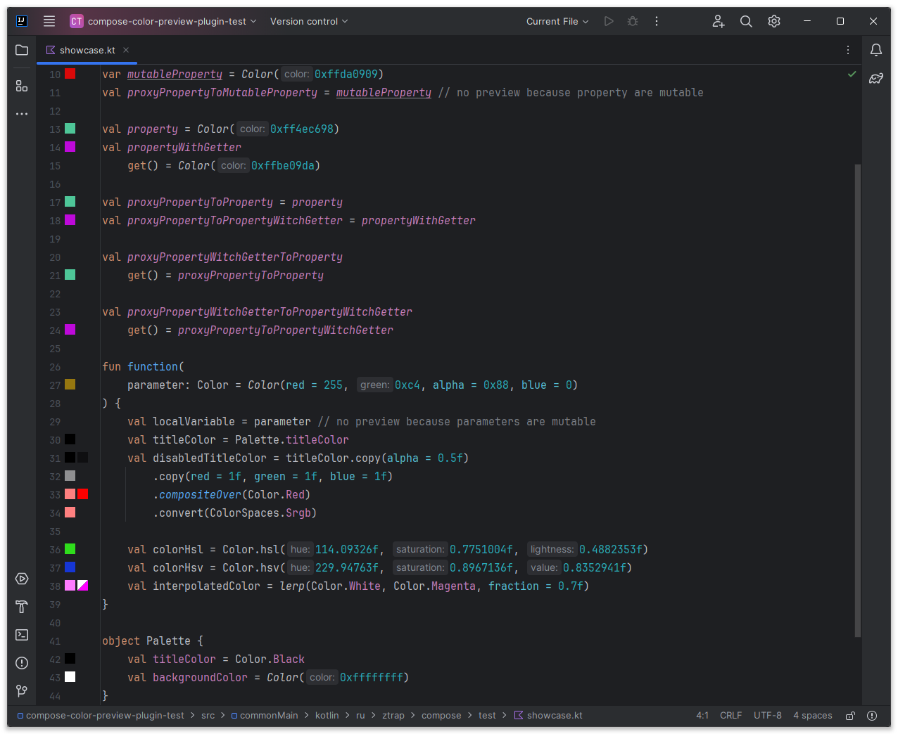
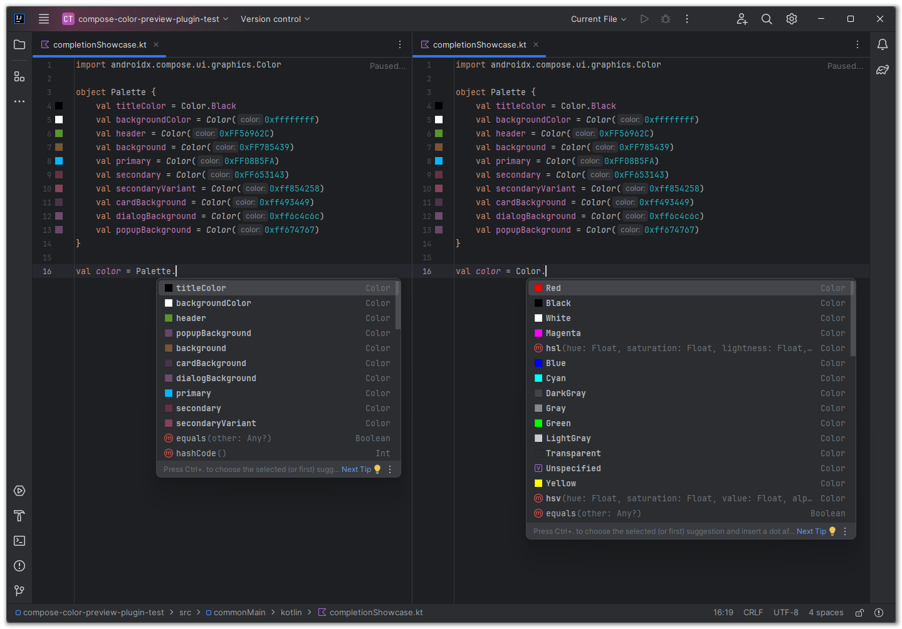

[](https://plugins.jetbrains.com/plugin/21298-compose-color-preview)

#  Compose color preview plugin for JetBrains IDE family

This plugin draws colors in the editor gutter and the code completion popup. You can modify them by clicking on the icons in the gutter

It works with the `androidx.compose.ui.graphics.Color` from
[Jetpack Compose](https://developer.android.com/develop/ui/compose) or
[Compose Multiplatform](https://www.jetbrains.com/lp/compose-multiplatform)

## Features

- [x] Shows preview in the code completion popup for simple constant fields
- [x] Shows preview in places simple constant fields usage with type `Color`
- [x] Shows preview for results of `compositeOver`, `copy`, `convert` and `lerp` functions
- [x] Shows preview in the `Color` creation places
    - [x] ULong constructor
    - [x] Long "constructor" function
    - [x] Int "constructor" function
    - [x] Int x3 "constructor" function
    - [x] Float x3 "constructor" function
    - [x] Float x3 with color scheme "constructor" function
    - [x] Float x4 "constructor" function
    - [x] Float x4 with color scheme "constructor" function
    - [x] hsl "constructor" function
    - [x] hsv "constructor" function
- [x] Shows palette by clicking on the icon to change color
    - [x] Change color with saving the original numeral system




## Installation

Install it from the Jetbrains plugin repository within your IDE (**recommended**):

- <kbd>Settings/Preferences</kbd> > <kbd>Plugins</kbd> > <kbd>Marketplace</kbd> > <kbd>Search 'Compose Color
  Preview'</kbd>

You can also download the JAR package from
the [Jetbrains plugin repository](https://plugins.jetbrains.com/plugin/21298-compose-color-preview) or
from [GitHub Releases](https://github.com/zTrap/compose-color-preview-plugin/releases) and add it manually to your
plugins:

- <kbd>Settings/Preferences</kbd> > <kbd>Plugins</kbd> > <kbd>⚙️</kbd> > <kbd>Install plugin from disk...</kbd>

## FAQ

<details>
  <summary>I have a duplicate preview in the color declaration line in Android Studio. How to fix it?</summary>
  <br/>
  You can simply disable one of the previews. 
  Go to <kbd>Settings/Preferences</kbd> > <kbd>Editor</kbd> > <kbd>General</kbd> > <kbd>Gutter Icons</kbd> and disable 
  "Compose color picker" from "Jetpack compose" section or "Color chooser" from "Compose Color Preview" section
</details>
<br/>
<details>
  <summary><s>Starting from IDEA 2024.1 colors list order in popup is reversed. Can you fix it?</s> <b>Fixed in IDEA 2024.2</b></summary>
  <br/>
  Unfortunately, no. It's Intellij IDEA Platform bug and <a href="https://youtrack.jetbrains.com/issue/IJPL-26348/Reversed-items-order-in-line-markers-popup">the issue</a> 
  is created. So we can only wait for a fix from JetBrains
  <br/>
</details>
<br/>
<details>
  <summary>Hex in color picker have wrong pattern. Can you fix it?</summary>
  <br/>
  Yes, but it requires a complete rewrite of the color picker popup which is not what I want to do. 
  The request for this feature has been <a href="https://youtrack.jetbrains.com/issue/IJPL-148574/Provide-the-ability-to-configure-the-hex-pattern-for-the-color-picker-in-gutter">submitted</a> to JetBrains, and we need to wait for a reaction
</details>

## Contribution

Contributions are welcome. Please check [CONTRIBUTING.md](./CONTRIBUTING.md) for more information.

Besides source code contributions, feel free to open bug reports or just suggest new
features [here](https://github.com/zTrap/compose-color-preview-plugin/issues).

## License

- [The Apache License Version 2.0](https://www.apache.org/licenses/LICENSE-2.0)

```
Copyright 2023-2024 Peter Gulko (zTrap)

Licensed under the Apache License, Version 2.0 (the "License");
you may not use this file except in compliance with the License.
You may obtain a copy of the License at

   https://www.apache.org/licenses/LICENSE-2.0

Unless required by applicable law or agreed to in writing, software
distributed under the License is distributed on an "AS IS" BASIS,
WITHOUT WARRANTIES OR CONDITIONS OF ANY KIND, either express or implied.
See the License for the specific language governing permissions and
limitations under the License.
```