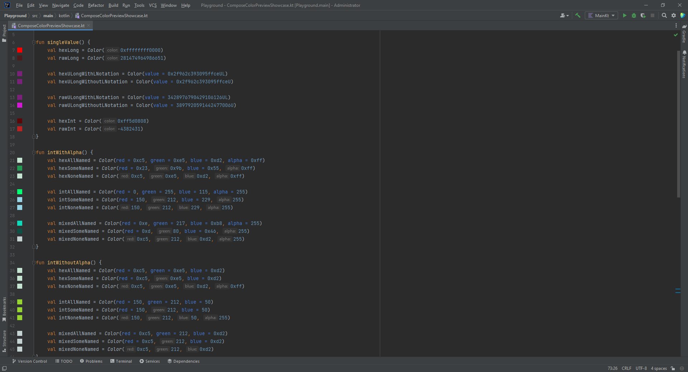

[](https://plugins.jetbrains.com/plugin/21298-compose-color-preview)

#  Compose color preview plugin for JetBrains IDE family

This plugin draws colors on editor's gutter. You can modify colors by clicking on the icons

It works with `androidx.compose.ui.graphics.Color` from
[Jetpack Compose](https://developer.android.com/develop/ui/compose) or
[Compose Multiplatform](https://www.jetbrains.com/lp/compose-multiplatform)

## Features

- [x] Show preview in `Color` creation places
    - [x] ULong constructor
    - [x] Long function "constructor"
    - [x] Int function "constructor"
    - [x] Int x3 function "constructor"
    - [x] Float x3 function "constructor"
    - [x] Float x3 with color scheme function "constructor"
    - [x] Float x4 function "constructor"
    - [x] Float x4 with color scheme function "constructor"
    - [x] hsl "constructor"
    - [x] hsv "constructor"
- [x] Show palette by clicking on preview to change color
    - [x] Change color with saving original numeral system
- [x] Show preview in places fields usage with type `Color`
- [x] Show preview for results of `compositeOver`, `copy`, `convert` and `lerp` functions



## Installation

Install it from the Jetbrains plugin repository within your IDE (**recommended**):

- <kbd>Settings/Preferences</kbd> > <kbd>Marketplace</kbd> > <kbd>Search 'Compose color preview'</kbd>

You can also download the JAR package from
the [Jetbrains plugin repository](https://plugins.jetbrains.com/plugin/21298-compose-color-preview) or
from [GitHub Releases](https://github.com/zTrap/compose-color-preview-plugin/releases) and add it manually to your
plugins:

- <kbd>Settings/Preferences</kbd> > <kbd>Plugins</kbd> > <kbd>⚙️</kbd> > <kbd>Install plugin from disk...</kbd>

## Contribution

Contributions are welcome. Please check [CONTRIBUTING.md](./CONTRIBUTING.md) for more information.

Besides source code contributions, feel free to open bug reports or just suggest new
features [here](https://github.com/zTrap/compose-color-preview-plugin/issues).

## License

- [The Apache License Version 2.0](https://www.apache.org/licenses/LICENSE-2.0)

```
Copyright 2023-2024 Peter Gulko (zTrap)

Licensed under the Apache License, Version 2.0 (the "License");
you may not use this file except in compliance with the License.
You may obtain a copy of the License at

   https://www.apache.org/licenses/LICENSE-2.0

Unless required by applicable law or agreed to in writing, software
distributed under the License is distributed on an "AS IS" BASIS,
WITHOUT WARRANTIES OR CONDITIONS OF ANY KIND, either express or implied.
See the License for the specific language governing permissions and
limitations under the License.
```